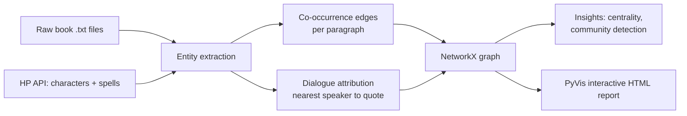

# Harry Potter Entity Graph

An entity-relationship graph built from the text of Harry Potter books 1–4,
capturing characters, spells, places, and creatures, and the relationships
between them (co-occurrence in scenes, and who speaks in dialogue).

## Overview

The pipeline extracts entities using a curated gazetteer (character/spell
data from the public [HP API](https://hp-api.onrender.com), supplemented
with a small hand-curated list of places and creatures), scans the raw book
text for mentions, builds a weighted co-occurrence + dialogue-attribution
graph with NetworkX, and renders it as an interactive network via PyVis.

## Flow



## Usage

```bash
pip install -r requirements.txt
python scripts/fetch_characters.py   # pulls character metadata
python scripts/extract.py            # builds entities + relations from book text
python scripts/build_graph.py        # builds the graph, prints insights
python scripts/visualize.py          # renders report.html
```

Open `report.html` in a browser. Nodes are colored by Hogwarts House
(characters) or entity type (places/spells/creatures); node size reflects
weighted degree (how connected an entity is); hover for details.

## Entity/relation extraction approach

Entities are matched via a gazetteer built from the HP API's character and
spell lists, supplemented with a manually curated list of ~25 well-known
places and creatures. Aliases (nicknames, alternate names) are included
where they're unambiguous — first/last names are only added as standalone
aliases if unique across the full character list, to avoid collisions
(e.g. "Weasley" alone is not used as an alias, since ~9 characters share it).

Two relation types are extracted:
- **Co-occurrence**: any two entities mentioned in the same paragraph get
  an edge, weighted by how often that pairing recurs.
- **Dialogue attribution**: quoted text is matched via regex, and
  attributed to the nearest character name within an 80-character window
  before/after the quote.

**Precision/recall tradeoffs:**
- *Precision* is high for named, well-known entities (gazetteer matching
  avoids the false positives generic NER produces on invented words like
  spell names or magical creatures).
- *Recall* is limited to entities present in the HP API / curated lists —
  minor one-off characters not in that dataset are missed entirely, and no
  coreference resolution is done, so "he," "she," or "the old man" are
  never attributed.
- Dialogue attribution is a proximity heuristic, not true speaker
  identification — it will misattribute quotes in dense back-and-forth
  dialogue with multiple characters in the same window.
- Raw co-occurrence weight favors entities mentioned constantly regardless
  of relationship strength — "Hogwarts" and "Gryffindor" rank among the
  most "connected" entities in the graph purely from mention frequency,
  not because they have meaningfully close relationships with everyone.
  A TF-IDF or PMI-based edge weighting would correct for this in future work.

## Data structure

A single `networkx.Graph`: nodes carry `type` (character/place/spell/
creature), `house`, `species`, `lines_spoken`, and `community` attributes;
edges carry aggregate `weight` (co-occurrence count) and `books` (how many
books the pairing appears in). This makes it directly queryable for
insights (`G.degree(weight="weight")`, `nx.algorithms.community.*`, etc.)
without a separate database.

## Insights

- **Most connected entities** (weighted degree): Harry Potter, Ron Weasley,
  and Hermione Granger dominate, as expected — but Hogwarts and Gryffindor
  (place entities) rank in the top 6, ahead of most named characters,
  purely by mention frequency (see limitation above).
- **Most talkative characters**: Harry, Ron, and Hermione lead, but Alastor
  "Mad-Eye" Moody ranks 5th overall despite appearing substantially in only
  one of the four books analyzed — a concentrated presence rather than a
  sustained one.
- **Surprising insight — community structure vs. Hogwarts Houses**:
  greedy modularity community detection (run purely on narrative
  co-occurrence, with no knowledge of House assignments) produces
  communities with only ~50-59% House purity. Despite how central House
  identity is to the books' social structure, who characters actually
  interact with in the text is driven more by shared classes, Quidditch,
  and plot events than by House lines — the detected social clusters cut
  across Gryffindor/Slytherin/Ravenclaw/Hufflepuff boundaries far more than
  a "House-first" reading of the books would suggest.

## Video Demo

See `demo/demo.mp4` for a walkthrough of the interactive report and the
community-structure insight.

## Limitations / future work

- Extend to books 5–7 for full-series coverage.
- Add coreference resolution to catch pronoun references.
- Normalize edge weights (PMI/TF-IDF) to reduce high-frequency-entity bias.
- Expand the place/creature gazetteer (currently hand-curated, ~25 entries).
